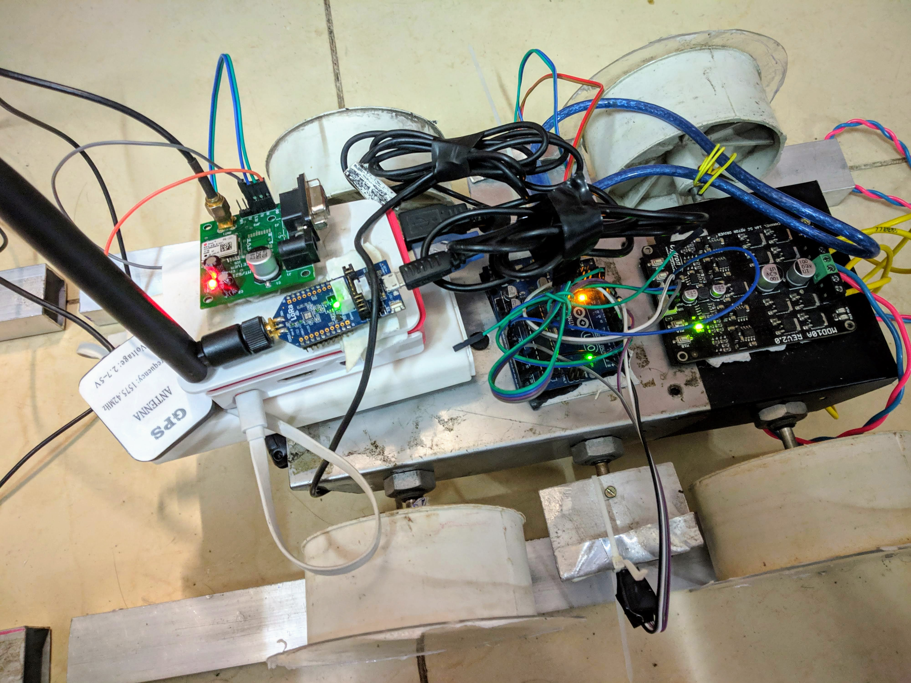

# Hardware Component
This part of the project is based on hardware modules. It demonstrates real time graph of different sensors. One can view the real time graph, switch on or switch off the sensor, view live camera view with 20FPS and 100ms ping. All this data can be visualized in a remote application.
## Hardware Used
### Raspberry Pi(Server for Flask and arduino)
Raspberry is used to take value from different sensors via arduino and upload the same on server in real time.
### Arduino(Gateway for sensor)
Using serial monitor to take sensor data and publish onto pi COM Port.
### Ultrasonic Sensor (For Prototype purpose)
This sensor returns the distance of the object from the sensor using ultrasonic waves. In actual development phase, a special Panasonic laser sensor LS-300/LS-400 will be used. 
### Camera
Used for live streaming. This will only be used for prototype phase.
### Project Video Link
youtube
# Project Snap

# Bot Pics

