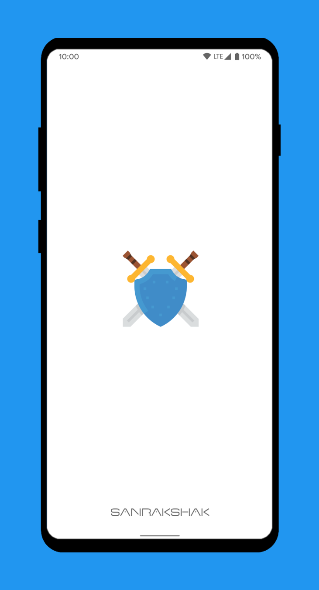
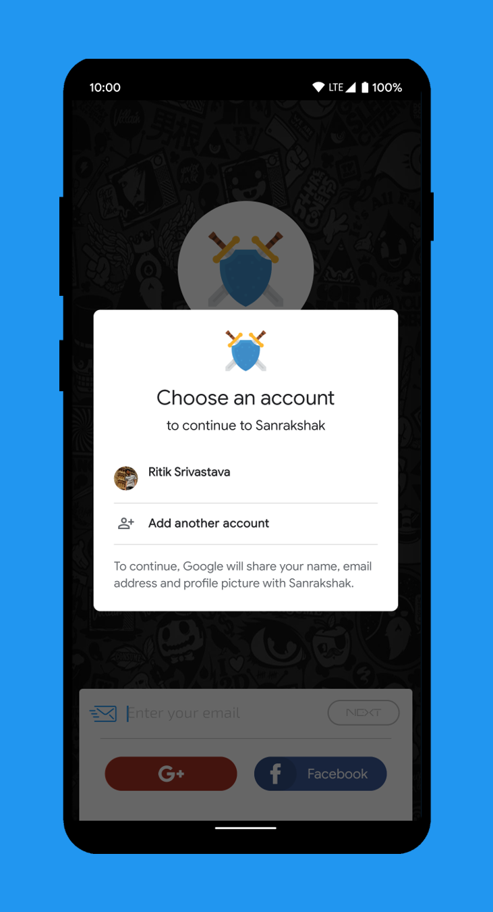
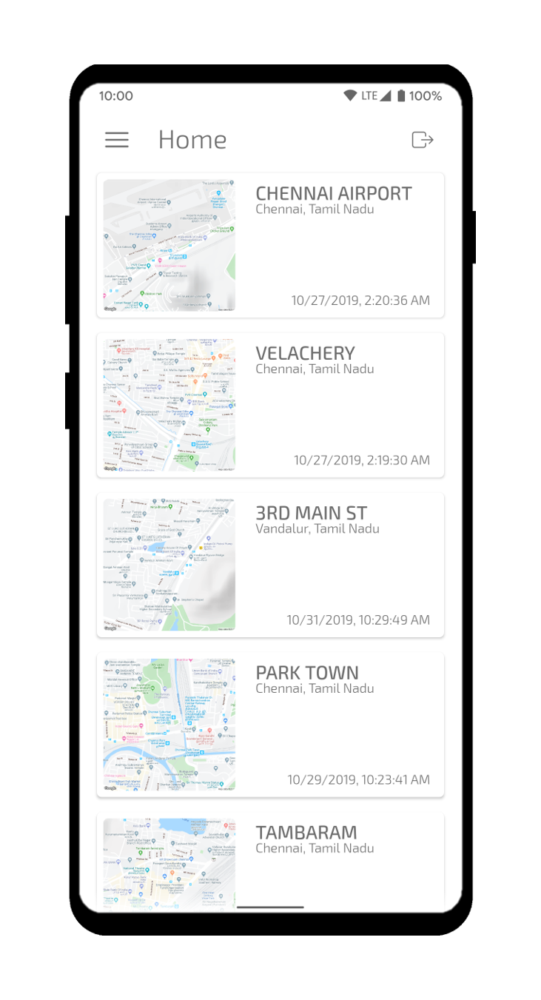
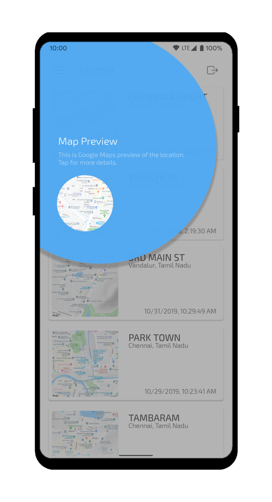
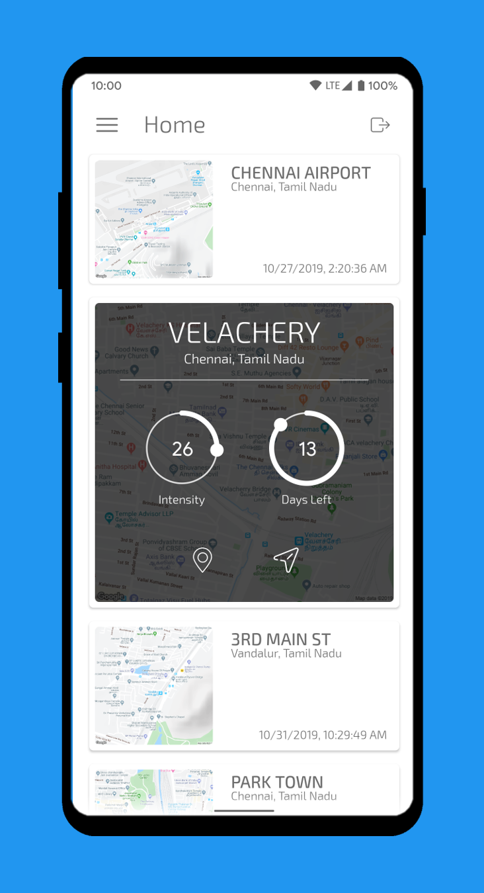
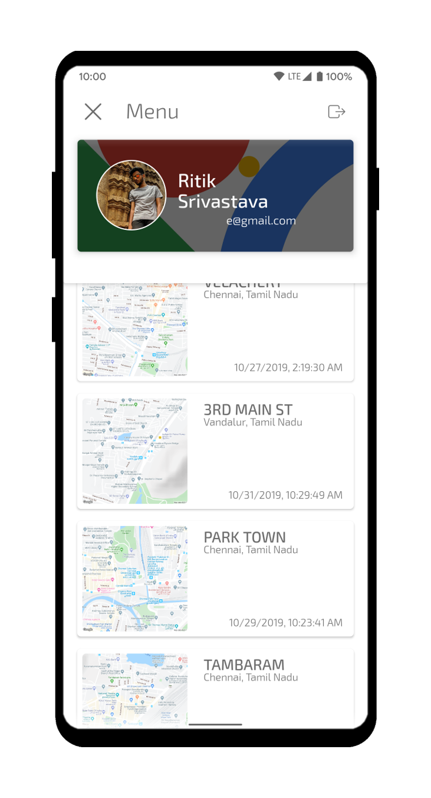
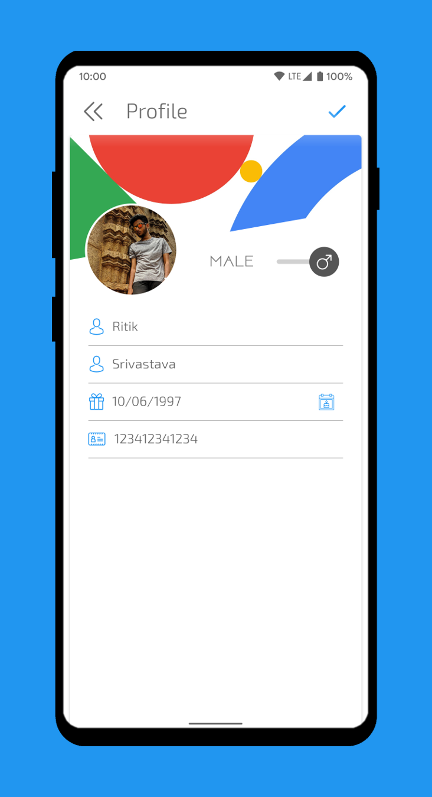

# Sanrakshak Mobile Application
Solving a problem may be the most important part of a mission, But having the power in our hands to visualise and track the progress is important as well. That is why we came up with our mobile application. Sanrakshak Application is a dynamic mobile application built completely on Android Studio.

## Features
+ Stunning user interface with unique animations.
+ Two types of application access
  - Full Access
  - Limited Access
+ Signup and Login via Google and Facebook.
+ Detailed crack inspection
  - Title of location of the crack.
  - Map preview of location of the crack.
  - Date of discovery of the crack.
  - Intensity of the crack.
  - Number of days allocated to fix the crack.
+ Locate the location of crack on Google Maps.
+ Navigate to the location using the shortest path on Google Maps.

## Screenshots

## Download  
**Sanrakshak Mobile Application** is packed with lot of features and provides you with details of the detected crack. Get your hands on it now. 

