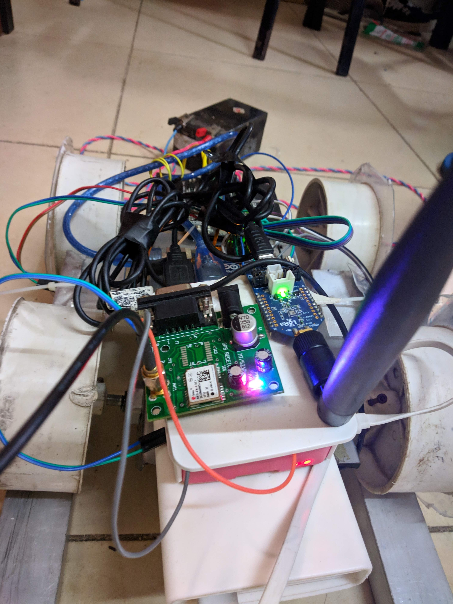
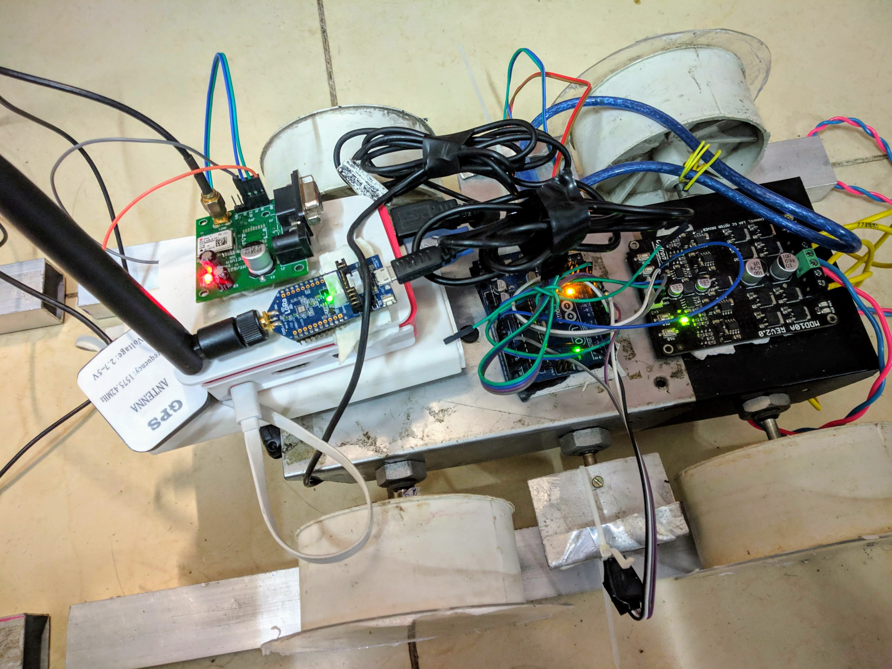

# Sanrakshak
We at Sanrakshak have pledged to provide utmost safe and secure railway journey to our fellow passengers by attaching our robust and affordable sensors beneath the engine of the train which provides real time data about the occurrence of cracks or any kind of faults on the railway line and ultimately offers a holistic end to end solution to the government. 

Sanrakshak can be divided into three different fields
- [Robot](Hardware/)
- [Mobile Application](Mobile%20Application/)
- [Web Server](Backend/)

## Problem
1,394 train accidents were reported In India over the ten years and out of these accidents, 51% or 708 were due to derailments. Indian Railways has a mechanism in place for anti-collision of trains but still they don’t have any effective real time solution to predict cracks (main cause of derailment) in railway tracks

## Solution
+ We are using two high-speed ultrasonic transducers on either side of the train engine to detect cracks on the railway lines.
+ Thermal gaps on the railway lines are often confused with cracks, so we are using a speedometer to precisely measure the speed and time for the occurrence of thermal gaps.
+ Moreover, a high speed (>300 fps) camera is installed which records the data to effectively ensure the occurrence of cracks.
+ Data given by the sensors and the camera is processed real time by an SOC (System on a Chip) possessing multicore server.
+ We are using advance machine learning techniques to detect the authenticity of the crack bythe data provided by the sensors. The video footage of the railway lines along with the GPS coordinates is transferred to an android application and iOS application to a distant location.
end solution to the government.

## Best Solution
+ Cracks on railway track don’t develop in a single day. These are developed over a period of time. Our technology helps to identify the cracks long before they become fatal and continuously send the GPS coordinate of the crack along with video footage to the nearest railway station or the railway master.
+ We give a fully fledged product containing all the sensors along with the camera and SoC (System On a Chip) which can be directly attached beneath the engine of the train thus the entire system is physically inaccessible and provides utmost accuracy in detection of faults at the most affordable price.

## Project Video Link
[

](https://www.youtube.com/watch?v=DDnyK07Cp5k)

## Prototype 

    

